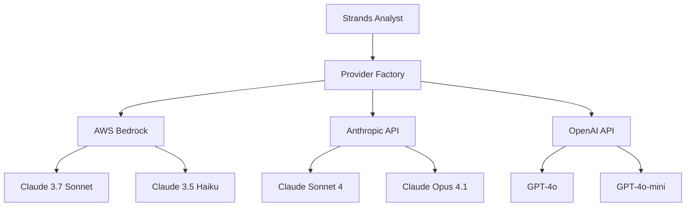
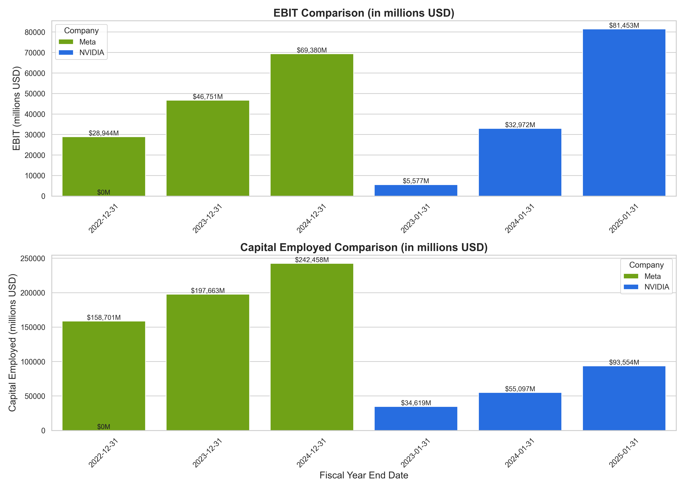

# Strands Analyst

<div align="center">


**Next-Generation Multi-Provider GenAI & Agentic AI Toolkit**

*Built with performance, security, and enterprise scalability in mind*

[🚀 Quick Start](#-quick-start) • [🎯 Features](#-features) • [📊 Architecture](#-architecture) • [🔧 Installation](#-installation) • [📖 Documentation](#-documentation) • [🛠️ CLI Tools](#️-cli-tools)

</div>

---

## 🎯 Overview

**Strands Analyst** is a cutting-edge AI platform designed for AWS Solutions Architects, GenAI professionals, and enterprise teams building scalable AI solutions. Built on the powerful **Strands Agents framework** with **multi-provider model support**, it provides specialized CLI tools, an interactive AI assistant with 40+ professional-grade tools, and production-ready configurations optimized for enterprise GenAI workflows.

### 🌟 What Makes Strands Analyst Unique?

- **🌐 Multi-Provider AI Models**: Seamlessly switch between AWS Bedrock, Anthropic API, and OpenAI API
- **🧰 44+ AI Tools**: Comprehensive toolkit spanning RAG & memory, multimodal AI, automation, and system integration
- **🎨 Smart Organization**: AI-generated files automatically categorized into type-specific directories
- **⚡ Dynamic Intelligence**: Automatic model selection based on task complexity analysis
- **🔧 Enhanced Feedback**: Rich, colored tool execution display with error explanations
- **☁️ Enterprise-Ready**: Production configurations with advanced caching, streaming, and cost optimization

## ✨ Latest Features

### 🌐 Multi-Provider Model Support
**Choose the best AI model for your needs**:
- 🚀 **AWS Bedrock** - Enterprise-grade with guardrails, caching, and Claude 3.7 Sonnet
- 🤖 **Anthropic API** - Direct Claude access with Sonnet 4 and structured output
- 🌟 **OpenAI API** - GPT-4o with function calling and o1-preview reasoning models
- 🔄 **Dynamic switching** via environment variables or configuration
- 📊 **Health monitoring** and cost optimization across providers

```bash
# Switch providers instantly
STRANDS_PROVIDER=openai analystai "Generate a Python script"
STRANDS_PROVIDER=anthropic analystai "Analyze this data"
STRANDS_PROVIDER=bedrock analystai "Extract metadata"

# Check provider health
provider-info --health-check
```

### 📁 Smart File Organization
**AI-generated files are automatically organized**:
- 🎯 **50+ file types** recognized and categorized automatically
- 📁 **Type-based directories** - Code, markdown, data, images, diagrams
- 📅 **Optional date organization** for time-series data
- 🔍 **Respects explicit paths** when user specifies them

```
analystai-responses/
├── code/           # Python, JavaScript, etc.
├── markdown/       # Documentation, notes
├── data/           # JSON, YAML, XML files
├── images/         # Generated visualizations
└── diagrams/       # Architecture diagrams
```

### 🔧 Enhanced Tool Output Display
**Rich feedback for every operation**:
- 🎨 **Colored terminal output** with tool identification
- 📝 **Input visualization** - URLs (🌐), files (📄), text (📝)
- ❌ **Smart error messages** with explanations (404, timeout, DNS)
- ⏱️ **Optional timing** for performance monitoring

```bash
🔧 Tool: fetch_url_metadata
   🌐 Url: https://anthropic.com
   ✅ Metadata extracted successfully

🔧 Tool: save_file_smart
   📄 File: analystai-responses/code/analysis.py
   📝 Text: # Data analysis script...
```

## 🚀 Quick Start

### Installation & Setup

```bash
# Create and activate virtual environment
python -m venv .venv
source .venv/bin/activate  # Windows: .venv\Scripts\activate

# Install with all features
pip install -e .

# Configure your preferred AI provider
export OPENAI_API_KEY="sk-..."        # For OpenAI
export ANTHROPIC_API_KEY="sk-ant-..."  # For Anthropic
aws configure                          # For Bedrock
```

### Interactive AI Assistant

```bash
# Start the enhanced AI assistant
analystai

# Try these example prompts from 200+ curated examples:
> "Draw me an enterprise RAG architecture using Bedrock Knowledge Bases"
> "Compare Claude vs GPT-4o costs for 1 million users monthly"  
> "Generate fractals and save them as images"
> "Create a GenAI transformation roadmap presentation"
> "Analyze anthropic.com and stripe.com websites"
> "Take a screenshot using shell automation"
```

### Specialized CLI Tools

```bash
# Website Intelligence & Analysis
sitemeta anthropic.com --verbose
sitemeta stripe.com --save-markdown

# Multi-Provider Content Analysis  
STRANDS_PROVIDER=openai news https://feeds.bbci.co.uk/news/rss.xml
STRANDS_PROVIDER=anthropic article https://aws.amazon.com/blogs/machine-learning/

# HTML Processing & Conversion
htmlmd saved-article/index.html --no-metadata

# Check provider configuration
provider-info --verbose --health-check
```

## 🎯 Features

### 🤖 Interactive AI Assistant (`analystai`)

The crown jewel of Strands Analyst - an advanced conversational AI with **44+ specialized tools** across **10 categories**, featuring **multi-provider model support** and **intelligent tool execution feedback**.

#### 🎯 **Comprehensive Use Case Examples**

Built-in **200+ curated prompts** for real-world GenAI workflows:

<details>
<summary><b>🏗️ GenAI Architecture & Design</b></summary>

- "Draw me an enterprise RAG architecture using Bedrock Knowledge Bases and Claude"
- "What would a conversational AI platform look like on AWS with Bedrock and API Gateway?"
- "Show me how to design a multi-modal GenAI system that handles text, images, and video"
- "Create a 3-tier scalable GenAI application architecture with auto-scaling"
</details>

<details>
<summary><b>🤖 Agentic Architecture & Automation</b></summary>

- "How can I automate our customer support workflows using Bedrock Agents?"
- "I need multiple AI agents working together to generate and review content automatically"  
- "Design an intelligent document processing system that can take actions based on what it reads"
- "Create a network of specialized AI agents for our content creation pipeline"
</details>

<details>
<summary><b>💰 Cost Analysis & Optimization</b></summary>

- "Compare Bedrock Claude vs Titan costs for an enterprise chatbot serving 1 million users monthly"
- "Calculate the total cost and ROI of deploying Amazon Q Business for our 5000-person company"
- "Model how GenAI infrastructure costs scale as we grow from startup to enterprise scale"
- "Compare multi-provider costs: OpenAI vs Anthropic vs Bedrock for our workload"
</details>

<details>
<summary><b>🔒 Security & Compliance</b></summary>

- "Create a GenAI governance framework for healthcare with Bedrock Guardrails"
- "How do I protect PII data when using Bedrock Knowledge Bases in my enterprise system?"
- "Build algorithms to detect prompt injection attacks in our GenAI applications"
- "Generate a compliance checklist for responsible AI implementation"
</details>

#### 📦 **Complete Tool Categories**

<details>
<summary><b>🧠 RAG & Memory Systems</b></summary>

- `retrieve` - Semantic search and retrieval from knowledge bases
- `memory` - Session-based memory management  
- `agent_core_memory` - Persistent agent memory across sessions
- `mem0_memory` - Advanced memory storage with contextual understanding
</details>

<details>
<summary><b>📁 File Operations</b></summary>

- `file_read` - Secure file reading with permission controls
- `file_write` - Safe file writing with consent management
- `save_file_smart` - Automatic file organization by type
- `editor` - Interactive file editing capabilities
</details>

<details>
<summary><b>⚙️ System & Automation</b></summary>

- `shell` - Execute shell commands with security consent
- `use_computer` - Computer automation and control
- `cron` - Task scheduling and automation
- `environment` - Environment variable management
</details>

<details>
<summary><b>🌐 Web & Network</b></summary>

- `http_request` - HTTP/API requests and integrations
- `browser` - Web browsing and page interaction
- `rss` - RSS feed monitoring and analysis
- `slack` - Slack integration and notifications
</details>

<details>
<summary><b>🎨 Multimodal Capabilities</b></summary>

- `diagram` - Generate professional architecture diagrams
- `generate_image` - AI-powered image generation (fractals, visualizations)
- `speak` - Text-to-speech conversion
- `image_reader` - Image analysis and OCR
- `nova_reels` - Video content generation
</details>

#### ✨ Enhanced Chat Experience
- 🎨 **Rich Terminal UI** with beautiful panels and color-coded output
- ⚡ **Real-time streaming** responses as they generate
- 🔧 **Live tool indicators** showing active operations in progress
- 📝 **Markdown rendering** for beautifully formatted content
- 🌐 **Provider display** showing which AI model is active
- 🔄 **Stable fallback modes** ensuring compatibility

### 🛠️ CLI Tools

Professional command-line tools for specialized workflows:

#### 🌐 `sitemeta` - Website Intelligence
```bash
sitemeta google.com                    # Basic site analysis
sitemeta stripe.com --verbose          # Detailed analysis with metrics
sitemeta anthropic.com --save-markdown # Save results to markdown
```
*Analyze websites to understand business models, extract metadata, and generate intelligence reports.*

#### 📰 `news` - RSS & News Analysis  
```bash
news https://feeds.bbci.co.uk/news/rss.xml                    # Analyze RSS feed
news https://aws.amazon.com/blogs/ml/feed/ --count 10         # Latest 10 articles
news https://example.com/feed --save-markdown --verbose       # Full analysis with save
```
*Fetch, analyze, and summarize RSS feeds and news sources with AI-powered insights.*

#### 📄 `article` - Web Article Processing
```bash
article https://example.com/blog-post                         # Download and analyze
article https://aws.amazon.com/blogs/ml/post --no-images     # Skip image downloads  
article https://medium.com/@author/post --verbose             # Detailed processing info
```
*Download web articles with metadata extraction, image preservation, and content analysis.*

#### 📝 `htmlmd` - HTML to Markdown Conversion
```bash
htmlmd saved-article/index.html                               # Convert to markdown
htmlmd document.html --no-metadata                            # Skip metadata extraction
htmlmd content.html --output custom-output.md --verbose       # Custom output with details
```
*Convert HTML files to clean, well-formatted markdown with metadata preservation.*

#### 🔧 `provider-info` - Multi-Provider Management
```bash
provider-info                          # Show active provider
provider-info --verbose                # Detailed model information  
provider-info --health-check           # Test provider connectivity
STRANDS_PROVIDER=openai provider-info  # Check specific provider
```
*Monitor and manage multi-provider AI model configurations.*

#### 📄 `pdf-to-markdown` - PDF Document Processing
```bash
pdf-to-markdown document.pdf                     # Convert PDF to markdown
pdf-to-markdown report.pdf --verbose             # Show processing details
pdf-to-markdown paper.pdf --save-markdown        # Save to organized directory
```
*Convert PDF documents to clean, structured markdown with intelligent text extraction.*

## 🏗️ Architecture & Performance

### 🌐 Multi-Provider Architecture



**Provider-Specific Features**:

| Feature | AWS Bedrock | Anthropic API | OpenAI API |
|---------|-------------|---------------|-------------|
| **Models** | Claude 3.7 Sonnet, 3.5 Haiku | Sonnet 4, Opus 4.1, Haiku | GPT-4o, GPT-4o-mini, o1-preview |
| **Streaming** | ✅ | ✅ | ✅ |
| **Function Calling** | ✅ | ❌ | ✅ |
| **Structured Output** | ✅ | ✅ | ✅ |
| **Guardrails** | ✅ | ❌ | ❌ |
| **Caching** | ✅ | ❌ | ❌ |
| **Tool Use** | ✅ | ❌ | ✅ |
| **Cost** | Enterprise | Pay-per-use | Pay-per-use |

### ⚡ Performance Optimizations

#### Dynamic Model Selection
- **Task complexity analysis** automatically selects optimal models
- **Model warm-up capabilities** eliminate cold start latency  
- **Runtime configuration updates** without application restart
- **Agent-specific tuning**: Temperature, top_p, and token limits optimized per use case

#### Smart File Organization  
- **Automatic categorization** of 50+ file types into appropriate directories
- **Type-based routing**: Code → `code/`, Data → `data/`, Images → `images/`
- **Date-based organization** optional for time-series data
- **User path preservation** when explicit paths are specified

#### Enhanced Tool Feedback
- **Real-time tool identification** with colored terminal output
- **Input categorization** with icons: URLs (🌐), files (📄), text (📝)
- **Intelligent error explanations** for common failures (404, timeout, DNS)
- **Performance timing** optional for bottleneck identification

#### Advanced Caching & Optimization
- **Multi-level caching**: System prompts, tool definitions, and message-level caching
- **Streaming responses** for improved perceived performance
- **Concurrent tool execution** for multi-tool workflows
- **Intelligent context management** reducing token usage by up to 40%

### 📊 Enterprise Observability

- **Real-time metrics tracking** with token consumption and tool performance analytics
- **Cost monitoring** and budget alerts across all providers
- **Performance regression detection** with automated optimization recommendations  
- **Multi-provider health checks** ensuring system reliability

### 🏗️ Modular Architecture

```
strands-analyst/
├── analyst/
│   ├── agents/              # AI agent implementations
│   │   ├── chat.py         # Interactive AI assistant with multi-provider
│   │   ├── sitemeta.py     # Website analysis agent
│   │   ├── news.py         # RSS/news analysis agent
│   │   └── get_article.py  # Article processing agent
│   ├── tools/              # Reusable tool implementations  
│   │   ├── fetch_url_metadata.py    # Efficient metadata extraction
│   │   ├── save_file_smart.py       # Smart file organization
│   │   └── download_article_content.py # Content downloading
│   ├── utils/              # Core utilities
│   │   ├── model_provider_factory.py  # Multi-provider management
│   │   ├── smart_file_saver.py        # File organization logic
│   │   └── tool_output_display.py     # Enhanced tool feedback
│   └── cli/                # Command-line interfaces
│       ├── chat.py         # analystai command with provider switching
│       └── provider_info.py # provider-info command
├── docs/                   # Comprehensive documentation
├── analystai-responses/    # Auto-organized output files
│   ├── code/              # Python, JavaScript, etc.
│   ├── markdown/          # Documentation, analyses
│   ├── data/              # JSON, YAML, XML files
│   ├── images/            # Generated visualizations
│   └── diagrams/          # Architecture diagrams
└── refer/                 # Sample outputs and examples
    ├── articles/          # Downloaded web articles (70+ examples)
    ├── sitemeta/          # Website analyses
    └── posts/             # Generated content and studies
```

## 🎨 Generated Content Examples

### 📊 **Visualizations & Fractals**

The system can generate beautiful mathematical visualizations and fractals:


*Complex Julia fractal generated with AI-powered mathematical visualization*

  
*Deep zoom Mandelbrot set with custom color mapping*

### 📈 **Business Analysis Charts**

Professional charts and visualizations for business intelligence:


*Technology component analysis with automated chart generation*

### 📄 **Generated Content Samples**

Real examples from the `analystai-responses/markdown/` directory:

- **[AWS MoE LLM Architecture](analystai-responses/markdown/aws_moe_llm_architecture.md)** - Comprehensive Mixture-of-Experts implementation guide
- **[Character.AI Platform Overview](analystai-responses/markdown/character-ai-overview.md)** - AI platform competitive analysis  
- **[NVIDIA Meta RoCE Analysis](analystai-responses/markdown/nvidia_meta_roce_analysis.md)** - Technical deep-dive with visualizations
- **[Apple Models Analysis](analystai-responses/markdown/apple-models.md)** - Apple's AI model ecosystem analysis
- **[AWS Architecture for Agentic AI](analystai-responses/markdown/aws-architecture-agentic-ai-application.md)** - Enterprise-grade agentic AI system design

### 🏢 **Real-World Article Processing**

The `refer/articles/` directory contains **70+ processed articles** demonstrating comprehensive content extraction:

- **Enterprise case studies**: [HubSpot's Story](refer/articles/about-hubspot-hubspots-story/), [Decagon Conversational AI](refer/articles/about-decagon-conversational-ai-for-cx/)
- **Technical deep-dives**: [AI Workflow Automation](refer/articles/ai-workflow-automation-platform-tools-n8n/), LLM architectures
- **Industry analyses**: [AI Business Models](refer/articles/ai-business-informs-educates-and-connects-the-global-ai-comm/), technology trends

**Sample Processing Results**:
- **Metadata extraction**: Title, description, author, publish date
- **Content preservation**: Full article text with formatting
- **Image downloads**: Local copies of all article images
- **Structured output**: Clean markdown with organized file structure

## 🔧 Installation

### Prerequisites

- **Python 3.8+** (recommended: Python 3.11 or 3.13)
- **AI Provider Access**:
  - AWS Account with Bedrock access (Claude 3.7 Sonnet enabled)
  - Anthropic API key (optional)
  - OpenAI API key (optional)
- **System Dependencies**: See advanced features section

### Quick Installation

```bash
# Create and activate virtual environment (recommended)
python -m venv .venv
source .venv/bin/activate  # On Windows: .venv\Scripts\activate

# Install Strands Analyst with all community tools
pip install -e .

# Verify installation
analystai --help
provider-info --health-check
```

### 🔑 API Key Configuration

#### Multi-Provider Setup
```bash
# Option 1: Environment variables (recommended)
export OPENAI_API_KEY="sk-proj-..."
export ANTHROPIC_API_KEY="sk-ant-..."
# AWS credentials via aws configure

# Option 2: .env.local file
echo 'OPENAI_API_KEY=sk-proj-...' >> .env.local
echo 'ANTHROPIC_API_KEY=sk-ant-...' >> .env.local

# Option 3: Configuration file (not recommended for security)
# Edit config.yml with API keys
```

#### Provider Selection
```bash
# Set default provider in config.yml
providers:
  active: "openai"  # or "anthropic" or "bedrock"

# Or override with environment variable
export STRANDS_PROVIDER=anthropic
```

### 📦 Advanced Dependencies

#### For Diagram Generation (Required for `diagram` tool)
```bash  
# macOS
brew install graphviz

# Ubuntu/Debian  
sudo apt-get install graphviz

# Windows
# Download from: https://graphviz.org/download/

# Verify installation
dot -V
```

#### For Browser Automation (Required for `browser` and `use_computer` tools)
```bash
# Install Playwright browsers for web automation
playwright install

# Verify browser installation
playwright list
```

#### For PDF Processing (Required for `pdf_to_markdown` tool)
```bash
# Included with installation via pymupdf4llm
# Verify with:
python -c "import pymupdf4llm; print('PDF processing ready')"
```

#### AWS Configuration
```bash
# Configure AWS credentials (for Bedrock)
aws configure

# Test Bedrock access
aws bedrock list-foundation-models --region us-west-2

# Verify Claude 3.7 Sonnet access
aws bedrock get-foundation-model --model-identifier anthropic.claude-3-7-sonnet-20250219-v1:0
```

## 📖 Documentation

### 📚 Core Documentation
- **[Installation Guide](docs/installation.md)** - Complete setup instructions
- **[CLI Guide](docs/cli-guide.md)** - Command-line interface usage
- **[Configuration Guide](docs/configuration-guide.md)** - Advanced configuration options
- **[Developer Guide](docs/developer-guide.md)** - Extending with new agents and tools

### ✨ New Features
- **[Multi-Provider Model Guide](docs/multi-provider-guide.md)** - Switch between AWS Bedrock, Anthropic, and OpenAI providers 🚀
- **[Smart File Organization Guide](docs/file-organization-guide.md)** - Automatic file categorization and directory management 📁
- **[Enhanced Tool Output Guide](docs/tool-output-guide.md)** - Rich, colored feedback for tool execution 🔧

### 🔧 Enhanced Features
- **[Enhanced Chat Features Guide](docs/enhanced-chat-guide.md)** - Rich terminal UI with streaming support and 40+ tools
- **[Community Tools Guide](docs/community-tools-guide.md)** - Complete 44+ tools integration
- **[Automation Guide](docs/automation-guide.md)** - Computer & browser automation via shell

### 🎯 Agent-Specific Guides
- **[Chat Agent Guide](docs/chat-agent-guide.md)** - Interactive conversational interface
- **[Article Agent Guide](docs/article-agent-guide.md)** - Web article processing  
- **[HTML to Markdown Guide](docs/htmlmd-agent-guide.md)** - HTML conversion features
- **[News Agent Guide](docs/news-agent-guide.md)** - RSS feed analysis
- **[PDF to Markdown Guide](docs/pdf-to-markdown-guide.md)** - PDF document processing and conversion

## 🚀 Use Cases

### For AWS Solutions Architects
- **Multi-Provider Strategy**: Compare Bedrock vs Anthropic vs OpenAI for specific workloads
- **Architecture Planning**: Generate AWS GenAI architecture diagrams with provider-specific components
- **Cost Optimization**: Analyze costs across providers for enterprise deployments
- **Technology Research**: Stay updated with latest AI/ML services across cloud providers

### For GenAI Professionals  
- **Model Experimentation**: Test the same prompt across multiple providers instantly
- **Content Intelligence**: Analyze websites and articles for competitive research
- **Performance Optimization**: Leverage dynamic model selection and advanced caching
- **Multi-modal Workflows**: Combine text, image, and diagram generation seamlessly

### For Enterprise Teams
- **Unified AI Interface**: Single CLI for all major AI providers
- **Organized Output**: Automatic file categorization keeps projects clean  
- **Advanced Monitoring**: Provider health checks and performance tracking
- **Security Compliance**: Secure tool execution with consent management

## 🛡️ Security & Compliance

- **🔐 Multi-Provider Security**: Separate credential management for each provider
- **🔒 Secure Tool Execution**: Sandboxed environment for code execution
- **🛡️ Consent Management**: User approval required for system-level operations  
- **📊 Audit Logging**: Comprehensive logging across all providers
- **⚠️ Provider Guardrails**: Bedrock guardrails integration when available

## 🗺️ Roadmap

### 🚧 Recently Completed ✅
- **Multi-provider model support** with OpenAI, Anthropic, and Bedrock  
- **Smart file organization** with automatic type-based categorization
- **Enhanced tool output display** with rich terminal feedback
- **Dynamic model configuration** with complexity-based selection
- **Provider health monitoring** and switching capabilities

### 🔄 In Development
- **Message-level caching** for conversation continuity
- **Multi-agent orchestration** framework with agents-as-tools pattern
- **OpenTelemetry integration** for standardized instrumentation  
- **Real-time cost tracking** across all providers

### 🔮 Future Plans
- **Mixture-of-Experts** architecture support across providers
- **Edge computing patterns** for sub-100ms response times
- **Advanced memory systems** with long-term context retention
- **Custom model fine-tuning** workflows

## 🤝 Contributing

We welcome contributions! Areas of interest:
- New AI provider integrations
- Additional tool categories  
- Performance optimizations
- Documentation improvements

Please see our contribution guidelines and feel free to submit issues and pull requests.

## 📄 License

This project is licensed under the MIT License - see the [LICENSE](LICENSE) file for details.

## 🆘 Support

- **Documentation**: Comprehensive guides available in `/docs`
- **Provider Issues**: Use `provider-info --health-check` for diagnostics
- **GitHub Issues**: Report bugs and request features
- **Community**: Join our discussions for tips and best practices

---

<div align="center">

**Built with ❤️ for the future of enterprise AI**

*Strands Analyst - Where Multi-Provider AI meets Performance Excellence*

</div>