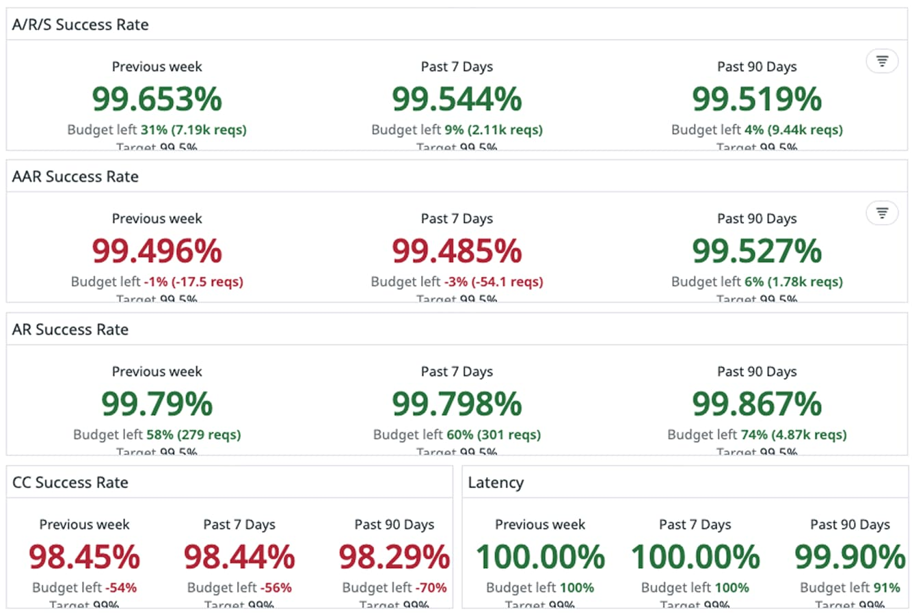
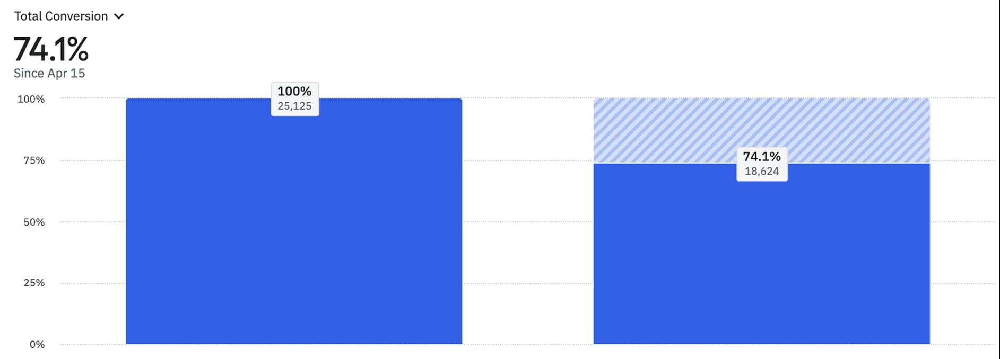
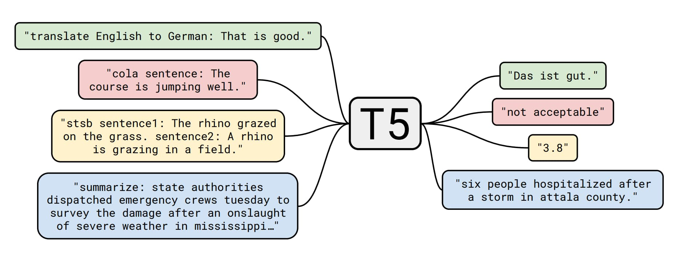
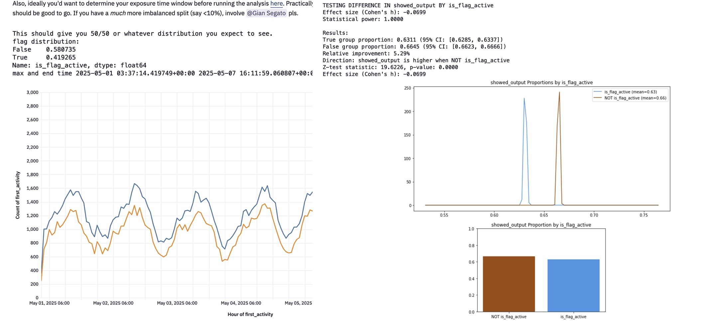
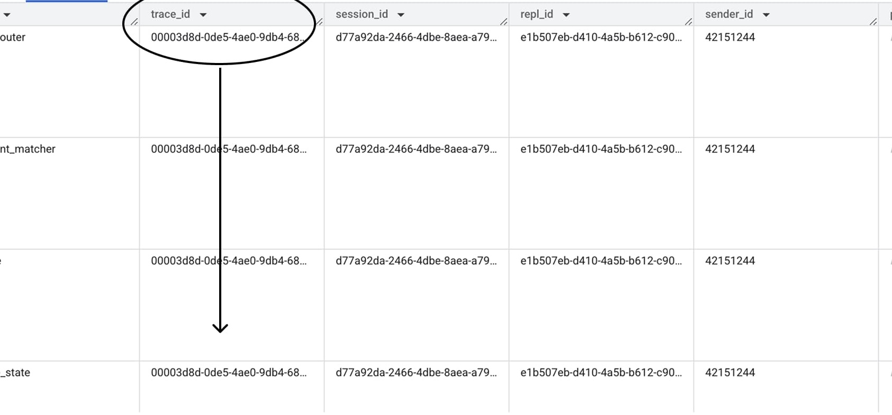

# Building AI Products In The Probabilistic Era

I was recently trying to convince a friend of mine that ChatGPT hasn't memorized every possible medical record, and that when she was passing her blood work results the model was doing pattern matching in ways that even OpenAI couldn't really foresee. She couldn't believe me, and I totally understand why. It's hard to accept that we invented a technology that we don't fully comprehend, and that exhibits behaviors that we didn't explicitly expect.

Dismissal is a common reaction when witnessing AI’s rate of progress. People struggle to reconcile their world model with what AI can now do, and *how*.

This isn't new. Mainstream intuition and cultural impact always lag behind new technical capabilities. When we started building businesses on the Internet three decades ago, the skepticism was similar. Sending checks to strangers and giving away services for free felt absurd. But those who grasped a new reality made of zero marginal costs and infinitely scalable distribution became incredibly wealthy. They understood that the old assumptions baked into their worldview no longer applied, and acted on it.

Eventually the world caught up[1](https://giansegato.com/essays/dawn-new-startup-era), and we reached a new equilibrium. In the last couple of decades the tech industry has evolved, developing a strong instinct for how to build and grow digital products online. We invented new jobs, from product management to head of growth, while others evolved, from engineering leadership to performance marketing. All have created their own playbooks to thrive.

AI is now shuffling the deck again.

Many of those playbooks have become obsolete. Something fundamental has shifted. General purpose artificial intelligence has created a rupture in the fabric of the tech industry, upending how we design, engineer, build, and grow software — and thus businesses that have software at their core.

We're now in a liminal moment, where our tools have outpaced our frameworks for understanding them.[2](https://jzhao.xyz/thoughts/information-scaling-threshold) This is a technical, epistemological, and organizational change, one where exceptional AI companies have started operating significantly differently from what we’ve known in the last decades.

Just as physics underwent a conceptual revolution when we moved past Newton's deterministic universe, and into a strange and counterintuitive place made by wave functions, software too is undergoing its own quantum shift. We're leaving a world where code reliably and deterministically takes certain inputs to produce specific outputs, and entering a very different one where machines now produce statistical distributions instead.

Building probabilistic software is like nothing we've done before.

## I. The Classical World

Today’s tech industry has been shaped by the core nature of software.

Like the software they’re made of, digital products map known inputs to expected results, deterministically. On Instagram, users can upload pictures, send messages, leave comments, follow accounts. On Netflix, they can search an item, pick an item, stream the video item. They choose an action, and expect a result to happen.

Let’s frame these products as functions `F: X → Y`.

Each input `x` is a user action inside the product, like “send a message on WhatsApp”, “book a ride on Uber”, and “search an address in Google Maps”. For each action `x`, the product yields an outcome `y`: the message will be sent, the ride will be booked, the address will be searched.

Through this framework, it’s possible to appreciate why startups and tech companies work the way they work.

This is most evident in engineering management.

The *classical* way of managing the performance of a software engineering team looks like this:

If you’ve ever had a developer job, you’ll immediately recognize a SLO Datadog dashboard. It’s what quantifies the reliability of a system. Since the engineer’s job is to build `F(x)`, we ask: does taking action `x` produce outcome `y` *every time*? Does it do so *reliably* no matter how many times you try? The goal is 100%: the function should always work as we expect.

That’s why layering, cautious refactors, and test-driven development are hallmarks of software engineering: they all stem from the ontological nature of the `F` mapping function. As the job to be done is always producing `y` when inputting `x`, we should write tests that make sure that’s always the case, we should be very wary of general refactorings, and careful when introducing new features that could impact the reliability of the arrow.

Product management and design too are about reliably mapping `x` to `y` — just at a different level of abstraction. For those teams, it’s about constructing a function `F` where the input `x` looks more like “the user watched an Instagram story for the first time”, producing a real-world outcome `y` like “the user is still using the product a month later”.

Good PM’ing is about drilling users through value funnels. The cardinality of the features is known beforehand: the input space `X` is a limited, pre-determined set of features and growth experiments. The goal is also pre-determined: designers and PMs know in advance what goals they're optimizing for. This means that, like for engineers, they too are striving to reach a 100% score on users going from experiencing a feature to yielding a business outcome. For these teams, it looks more like this:

Good design is not always quantifiable. Tasteful products aren’t about metrics. But ultimately they do exist to deliver value, and value is always delivered in funnels. When people stick around longer because they appreciate the tasteful design of a specific feature, that too qualifies as a funnel: from experiencing that feature, to keep paying long term.

Conversion, activation, and retention are all ratios that require countable, pre-defined inputs and outcomes. The reason why we can count those numbers and construct the ratios is because both the numerator and the denominator are *limited* and *pre-determined*: **what `x` and `y` can look like are known before the function is created!** By knowing their cardinality, we can create the funnel.

That’s why products like Amplitude and Mixpanel revolve around funnels, and the work of product and growth teams revolves around optimizing conversion rates.

All these ratios, be them engineering reliability goals or growth conversion targets, are how we make both strategic as well as tactical decisions in building and growing software products. How we measure performance, how we structure our work, how we design and implement our playbooks. The entire operating system of the tech industry relies on them.

The problem is that these rules, in the probabilistic world of AI, have the potential to become actively counterproductive.

## II. The Quantum Regime

Things started to change in the late 2010s, when we started to witness in AI models the first signs of true generalization. Until that point, machine learning systems were essentially “narrow experts” rather than “competent generalists.”[3](https://cdn.openai.com/better-language-models/language_models_are_unsupervised_multitask_learners.pdf)

In the last decade, however, researchers have realized that pre-training deep learning models on a lot of data “causes the model to develop *general-purpose* abilities and knowledge that can then be transferred to downstream tasks”[4](https://arxiv.org/abs/1910.10683). The idea is that if you focus on teaching AI the fundamental structure of the entire domain you’re interested in (say, language), you can unlock an entire class of tasks *all at once*, without the need to define them beforehand!, from identifying spam emails to answering trivia questions to role-playing fictional characters. Google’s T5 showed that “pre-training causes the model to develop *general-purpose* abilities and knowledge”, while OpenAI’s GPT-2 moved us “towards a more *general system* that can perform many tasks.”

The crucial bit here is that these models were *not* explicitly trained on all these tasks. When pre-trained on a large corpus of data and only fine-tuned on certain instructions, we can “substantially improve zero-shot performance on *unseen* tasks.” [5](https://arxiv.org/pdf/2109.01652)

I cannot emphasize enough how important “unseen” and “general-purpose” are, here. They’re what made this a truly watershed moment in the history of computing. It's no longer about teaching machines to recognize spam: it's about teaching them to speak. It's no longer about teaching machines to recognize bikes or tell animals apart: it's about giving them the sense of sight itself.

Think about it: we’ve built a special kind of function `F'` that for all we know can now accept *anything* — compose poetry, translate messages, even debug code! — and we expect it to always reply with something reasonable. For all intents and purposes, it’s the first time we stopped controlling the input space, which is now suddenly open-ended. `F(x)` has become `F'(?)`.

You can ask ChatGPT *anything*, from legal advice to romantic support, from spreadsheets analysis using code, to astrology predictions. You can ask Claude to produce any piece of software, from scripts, to websites, to marketing pages, to video games. Even inputting gibberish will still produce *something*. From a practical and philosophical standpoint, the cardinality of the input space is now basically infinite.

This is quite head scratching if you’re building AI products. What will users do with them? How can you make sure all your customers will always have a great experience? What if they discover an amazing new use case that these models can perform that you haven’t foreseen? What if they discover a bad use case that your marketing implied in the attempt of staying generic enough?

To make things worse, the correctness of the output isn't always guaranteed! A reply constructed to be reasonable doesn't mean it's going to be *correct*. What this new function will reply with is an estimate. Sometimes, a hallucination.

Can we solve hallucination? Well, we *could* train perfect systems to always try to reply correctly, but some questions simply don't have "correct" answers. What even is the "correct" answer when the question is "should I leave him?".

See, the problem is that the most interesting questions are not well defined. You can only have perfect answers when asking perfect questions, but more often than not, humans don’t know what they want. “Make me a landing page of my carwash business”. How many possible ways of achieving that objective are there? Nearly infinite. AI shines in ambiguity and uncertainty, precisely thanks to its emergent properties. If you need to know what’s 1+1, you should use a calculator, but knowing what your latest blood work results mean for your health requires nuance.

That's why when building an interface between humans and machines, the best form factor is a probability distribution ("you *likely* want this HTML with this hero banner", "you *likely* have a Vitamin D deficiency and should touch grass more"). It’s a shape that can naturally handle nuance.

That's the critical reason why we inject randomness into the output, and sampling at inference time: **prompting the product with the exact same inputs, will yield two different results**, making the output **stochastic**. This is a fundamental property of the technology, and what makes it work so well, as it provides users with a way to efficiently navigate complex problem spaces. It allows them to add their own taste to the final output, and navigate the probability distribution of all reasonable outputs according to their own judgement.

This is the result of two identical prompts using Claude 3.7:

It may feel subtle at the beginning, but over a sequence of chained generations composing a long trajectory, the difference greatly magnifies.

Output stochasticity and emergent behavior are the reasons why we can't expect perfect reliability from AI, not in the traditional sense. We are no longer guaranteed what `x` is going to be, and we're no longer certain about the output `y` either, because it's now drawn from a distribution.

**In moving to an AI-first world, we transitioned from funnels to *infinite fields***.

Stop for a moment to realize what this means. When building on top of this technology, our products can now succeed in ways we’ve never even imagined, and fail in ways we never intended.

This is incredibly new, not just for modern technology, but for human toolmaking itself. Any good engineer will know how the Internet works: we designed it! We know how packets of data move around, we know how bytes behave, even in uncertain environments like faulty connections. Any good aerospace engineer will tell you how to approach the moon with spaceships: we invented them! Knowledge is perfect, a cornerstone of the engineering discipline. If there’s a bug, there’s always a knowable reason: it’s just a matter of time to hunt it down and fix it.

With AI products, all this is no longer true. **These models are *discovered*, not engineered.** There's some deep unknowability about them that is both powerful and scary. Not even model makers know exactly what their creations can fully do when they train them. It's why "vibe" is such an apt word: faced with this inherent uncertainty, we're left to trust our own gut and intuition when judging what these models are truly capable of.

For people interacting with products harnessing the power of these models, this is a lot to take in, to accept, and to develop an intuition for. Users really dislike the inherent uncertainty of dealing with AI systems. They’re not used to it! They’re expecting a digital product like every other product they know: you instruct the app to perform an action, and the app will perform it. Unfortunately, prompting Replit in the wrong way may very well introduce a bug in your work, depending on your request and on the probability distribution that maps to. Consumers really struggle to understand this: it makes them very mad when the AI doesn’t do what they expect it to do.

The core reason why they get so frustrated is because **for the first time in the digital era marginal costs are way larger than zero**. In fact, they’re so large that they completely invalidate the business model and growth playbooks that dominated the Internet since the 90s. This may change in the future, depending on innovation and commoditization at hardware level, but for now the cost of intelligence is surprisingly stable (and not really as deflationary as we expected it to be until last year).

We have a class of products with deterministic cost and stochastic outputs: a built-in unresolved tension. Users insert the coin with *certainty*, but will be *uncertain* of whether they'll get back what they expect. This fundamental mismatch between deterministic mental models and probabilistic reality produces frustration — a gap the industry hasn't yet learned to bridge.

Software used to be magic black boxes offering a set of pre-defined options to pick from, and producing pre-determined results for practically-zero-margin cost. AI models are completely different entities: they accept a field of infinite possibilities, and produce probability distributions that collapse to potentially-unexpected observations after charging users very significant money.

It’s clear that the way to produce products around these two technologies needs to be radically different.

## III. It Takes A Scientist

To thrive in the quantum era, **successful organizations need to transition from engineering to empiricism**.

The tendency of old-school engineering leadership, when dealing with probabilistic software, is to slap reliability metrics on top of it. Good old SLO, like before. It's muscle memory, a reflex. But it creates perverse incentives: to achieve the reliability goal of 100%, classical engineering leadership naturally start adding more and more rails and constraints around the model, trying to reign it in and control it.

This doesn’t work anymore.

The more you try to control the model, the more you’ll nerf it, ultimately damaging the product itself. **Past a certain point, intelligence and control start becoming opposing needs.**

The goal isn’t perfection: by definition you can’t nor should aim for it. **The goal is to manage the uncertainty**. As an AI product builder, you should determine what’s the acceptable unpredictability that keeps the model capable of dealing with complexity, given the market you’re operating in and the audience you’re serving. Think in terms of Minimum Viable Intelligence: the lowest quality threshold that is both accepted by the market (some may be more sensitive than others), while preserving its inherent flexibility and generalization capacity.

The notion of Minimum Viable Intelligence stems from the emergent properties of these models. Companies building AI products may not know how powerful their product *actually* is, and may inadvertently constrain the model too much when trying to keep it on its rails. Think of how frustrating it would be for a user if asking Claude Code to add a watermark to each image in a folder would result in “sorry I can’t help with that: I can only make websites”. Because we know it can! If you do keep a healthy balance, your product could be so much larger than what you originally envisioned, thanks to the surprising things the models can do *without us even knowing*.

This is what forces a transition from engineering to empiricism: what will determine the correct way of building the product itself, and not just typical product management A/B testing, is now the scientific method.

**It takes a scientist to build AI products.**

The old wisdom of always building incrementally on top of what’s already there doesn’t hold up anymore. If anything, that too is actively harmful. Every time a new model drops, be it a new generation of an existing one (say, from Sonnet to Opus), or a completely new one (say swapping GPT for Gemini), all previous assumptions about its behavior should be disregarded.

In fact, when a new model drops, you should even consider literally *tearing down the full system*, and building it back from the ground up. There are no sacred cows.

When Replit moved from Sonnet 3.5 to 3.7, Replit’s President Michele had the company rewrite the *entire product* in less than 3 weeks. We called it Replit v2, but that was quite an understatement. In reality, it was a brand new product. The architecture, data model, prompting technique, context management, streaming design… it was all new. 3.7 was highly agentic in an entirely novel way, Michele understood it, and decided to lean into it instead of trying to control it. The team had to go through weeks of sleepless nights trying to beat the competition to market it successfully. Can you imagine what it takes to completely re-architect a product that was making almost $20m ARR at the time, rebuild it from the ground up in just three weeks, and to see its revenue inflect and end up growing to $100m ARR less than a quarter later? *It takes a scientist*. It’s no coincidence that Michele is, indeed, a scientist by trade.

Swapping models at the app layer is a big deal — which makes frontier labs stickier than they may look from the outside. It’s not “just an API commodity”. These models are not flat interfaces: they have personalities, and quirks. That’s why Gemini Pro 2.5 was not a Claude 3.5 killer despite still being an exceptionally good model. It takes hard work to fully prove that any given model is superior to any other one.

Every model update doesn’t necessarily mean a complete rewrite every time, but it does force you to fundamentally rethink your assumptions each time, making a rewrite a perfectly plausible hypothesis. You have to follow an empirical method, where the only valid assumption is “I don’t know”. Being an empiricist first is diametrically opposed to being an engineer first.

Even 'simple' improvements on the same base model require specialized data work. Any feature that ships needs to be tested, both in lab conditions using synthetic evals and in production with real-world usage. The test needs to be rigorous and thorough: it can't simply be a collection of binary "pass / not pass". What if a particular prompt change meaningfully impacts the model tendency to prefer a certain tool over another, actively altering the unit of economics for a certain segment of users? What if a particular design change impacts how users think about the input distribution, which in turn shapes the model output distribution in unforeseen ways?

The need for statistics when testing seemingly-atomic software improvements defies classical programmers' intuition. Many engineers consider this grueling data work not part of the job description, and they may be right!

It’s the job description that has changed.

## IV. Data is the New Operating System

Despite the fact that model behavior is intrinsically unknowable and uncertain, figuring out how to build an effective data function around it is incredibly difficult. Models’ emergent properties make synthetic testing elusive.

Engineers need to keep the eval dataset up to date with the distribution of actual user behavior, but by definition such dataset will constantly lag behind. Since the input space is no longer limited, you can't simply write a few selected tests and follow test-driven development: you'll risk breaking critical features without even being aware of their existence. Tweaking the prompt or swapping the base model for Replit meant unlocking latent features we never initially thought of, like game development. Having a good system in place to constantly sample the right test cases from real-world past usage is one of the most critical new pieces of work required today to build great AI products.

That’s also the reason why testing in production, with traditional A/B tests, is also critical: this way you can make sure to stay as close as possible to the general population you’re serving, and have a higher chance to test a long-tail outcome. Production testing, however, is potentially even harder than evals testing.

The elephant in the room when it comes to real-world live A/B testing is that it assumes you know what to optimize for in the first place. It implies knowing and quantifying the definition of success. In AI products, you basically can’t.

Users are exploring fields of possibilities, navigating through space composing trajectories: it’s really really hard to understand whether your product is accomplishing what it’s set to do! Say you just shipped a great new feature for the Replit agent: how do you know whether users are making “better software”? Longer chains of messages? Maybe they’re just debugging in frustration. Shorter and more efficient messages? Maybe they’re giving up faster. Sure you can measure long-term retention, but you can’t afford to wait weeks (or, worse, months!) to ship features.

This is what makes high-velocity AI shipping so challenging. Yet not impossible. Fundamentally it’s about moving from traditional growth funnels, to finding ways of aggregating “user trajectories” — paths through the field of possible tasks and model states.

The easiest way of approaching it is by segmenting user inputs. You use smaller models to classify user requests to larger models, which allows you to segment your data in “regions of usage”. It’s a crude way of clustering user journeys. For Replit’s coding agent, this could be coding use cases: “what’s the likelihood of getting a positive message from the user after 3 chat interactions, for all users that submitted a prompt about React web apps?” To push things further, you can use the same approach to define milestones to achieve across different paths, which might mean classifying model internal states.

This clearly impacts product management, design, go-to-market, and even (especially!) finance. As features become emergent, binary analytics events are no longer as useful as before to understand user behavior. Knowing that users acquired through TikTok are more likely to build games, which are more expensive to generate on a per-token basis and therefore impact the margin calculus, is *incredibly* valuable across the entire company: from engineers making sure that games are efficiently generated, to marketers shifting their top-of-the-funnel strategy to a more sustainable channel, to the finance team appropriately segmenting their CAC and LTV analysis. A 20% shift from game-building users to professional web apps might mean the difference between sustainable unit economics and bleeding money on every free user — yet this insight only emerges from analyzing the actual content of AI interactions, not traditional funnel metrics. That’s why classifying states is so crucial.

It all boils down to data. The value is being generated by the model, and data lives upstream and downstream of the model. We have years of literature about upstream data (for training), and the industry is keenly aware of its importance. But downstream data is something new, because we had true emergence at global scale for only a couple of years. Such scale is what makes the problem expensive, hard, complex, and requiring heavy data engineering. Architecting an AI product is no small feat, an increasingly sophisticated cross-disciplinary art.

More and more, in an era of stochastic unpredictable behaviors, data is becoming a crucial differentiating point when determining the success of an enterprise. It’s the shared operating system, longitudinal to the entire organization: a shared language and context that can describe reality and prescribe actions to shape it.

None of the core components of a tech company can afford to work in silos anymore. Things like customer attribution (in marketing, sales), observability (engineering), and A/B testing (product, design) used to be separate. In AI products, they collapse into one holistic system view where the core behavior of the product influences both the top of the funnel as well as the bottom line, from conversions to retention.

Only data can provide the map to understand this new, unknown function `F'`, and describe the journeys that users take when exploring and meandering through the emergent properties of AI products. Only data can inform where they’re going, whether they’re successful in reaching their destination, whether they can afford to get there.

**Data is not just the new oil to train AI models.**

**It’s also how we can truly harness its power.**

## V. This Time is Different

After decades of technical innovation, the world has (rightfully) developed some anti-bodies to tech hype. Mainstream audiences have become naturally skeptical of big claims of “the world is changing”. There’s now even a popular meme: “nothing ever happens”.

I strongly believe that when it comes to AI, something *is* happening. This time it *does* feel different.

It's ontologically different. We're moving away from deterministic mechanicism, a world of perfect information and perfect knowledge, and walking into one made of emergent unknown behaviors, where instead of planning and engineering we observe and hypothesize.

The shift is real, and it affects every part of the tech industry, altering how we make products, how we study and design them, and how we structure work around them. Organizations that build using an empirical approach, think in probabilities, and measure complex trajectories will define the next era of technology. The rest will keep trying to squeeze wave functions into spreadsheets, wondering why their perfectly deterministic dashboards can't capture what makes their products magical.

It’s a new world, a world of wonder and possibilities, a world to discover and understand.

Welcome to the Probabilistic Era.